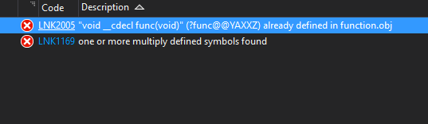

## 代码区

存放程序代码

## 全局数据区

存放全局和静态数据，该区的变量如果不初始化，则自动默认为0。全局数据区占有的空间始终存在，直到程序程序执行完毕。

## 栈区

存放局部变量和函数参数，，该区的空间会在数据使用完毕后自动释放。

## 堆区

动态内存分配运算符或函数为指针分配的内存处于堆区。堆区的空间不会被自动清空，只能使用释放内存的运算符或函数释放。

## 函数的传参方式

- 传地址：是指把实在参数的地址传递给相应的形式参数。
- 传值：这是最简单的参数传递方式。调用段把实参的值计算出来存放在一个可被调用的地方。
- 传名（宏替换）：过程调用中相当于把被调用段的过程体抄到调用出现的位置，把其中任一出现的形式参数都替换成相应的实参。

## 静态变量、全局变量的作用域和生命周期

| 类型 | 作用域 | 生命周期 |
|------|-------|----------|
| 局部静态变量 | 函数内部(与普通局部变量相同) | 整个程序周期(与全局变量相同 |
| 全局静态变量 | 文件内部 | 整个程序周期 |
| 全局变量 | 多个包含文件 | 整个程序周期 |

> 函数也是全局的，那么也会遇到类似全局变量命名冲突的问题。因此c提供了静态函数， 而静态函数仅在文件内可被调用。``` 在c++可能不存在函数全局的概念 ```

## 一个函数重定义的错误

main.cpp文件：

```cpp
#include "function.h"

int main() {
	func();
	system("pause");
}
```

function.h文件：

```cpp
#include <iostream>

void func() {
	std::cout << "func()" << std::endl;
}
```

当运行以上代码时报错：



这是链接器的错误，两个文件分别生成了function.obj和main.obj目标代码，当链接器生成最终目标可执行文件时，function.obj定义了func函数，而main.obj中由于#include指令包含进来的文件导致目标文件main.obj也拥有func函数，于是报错。

对于上面错误，将函数声明为static就不会LNK2005了。或者改为``` extern "C" void func ```作为c语言的全局函数。

> 将以上代码换成c语言就不会产生链接器错误了，或许c/c++生成目标程序的方式不一样吧:(
