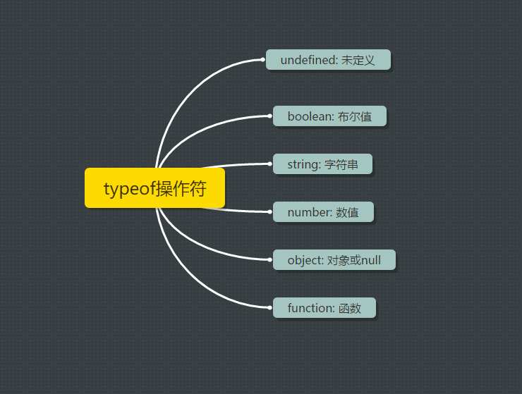

# Javascript基本概念（一）

## ECMAScript和Javascript及其相关语言

### 简介

ECMA全称为(European Computer Manufactures Association, 欧洲计算机制造商协会).
1996年网景公司将JavaScript提交给ECMA进行标准化。具体来讲JavaScript包含了以下：

- ECMAScript标准实现
- DOM
- BOM

> [相关阅读](https://huangxuan.me/2015/09/22/js-version/)

### nodejs

Node.js is a Javascript runtime built on Chrome's V8 Javascript engine.

> [nodejs为什么要用Javascript实现](https://www.zhihu.com/question/20383725)

### 相关语言CoffeScript, TypeScript, Dart

## JavaScript数据类型

### 五种基本数据类型(原始类型), 一种复杂数据类型Object(引用类型)

- Undefined
- Null
- Boolean
- Number
- String

> ECMAScript不支持任何创建自定义类型的机制， 而所有值最终都将是上述6种数据类型之一。




### Undefined

对未初始化和未声明的值执行typeof操作返回的值都是undefined, Undefied只有一个值undefined.

### Null

Null类型是第二个只有一个值的数据类型, 这个特殊的值是null.从逻辑角度看, null值表示一个空对象。

> undefined值实际上是派生自null值的，因此ECMA-262规定了他们的相等性测试要返回true。

```js
null == undefined // true
```

### Boolean

任何数据类型都可以调用Boolean函数转换为Boolean值。

| 数据类型 | 转换为true的值 | 转换为false的值 |
|--------------|---------------------|-----------------------|
| String | 任何非空字符串 | 空字符 |
| Number | 任何非零数字值(包含无穷大) | 0和NaN |
| Object | 任何对象 | null |
| Undefined | n/a(no applicable的缩写) | undefined |

> 上面的转换规则对理解控制流语句(如if)自动执行相应的Boolean转换非常重要.

### 数值转换

三个函数:

- Number()，不常用
- parseInt()
- parseFloat()

> 如果参数不是一个字符串，则将其转换为字符串。字符串开头和末尾的空白符将会被忽略。会截取字符串开头的一串数字作为值。

### 字符串

> 单双引号没有区别，但是推荐使用单引号。
在ECMAScript中的字符串是不可变的，一旦字符串创建它们的值就不能改变。要改变某个变量保存的字符串，首先要销毁原来的字符串，然后再用另一个包含新值的字符串填充该变量。

```js
var lang = 'Java';
lang = lang + 'Script';
// 首先创建了一个能容纳10个字符串的新字符串， 
// 然后在这个字符串中填充了'JavaScript'
// 最后销毁原来的字符串'Java'和'Script'
```

> 字符串转换
> 几乎每个值都有toString方法，除了undefined和null

## 函数

在ECMAScript中，函数实际上是对象。每一个函数都是Function类型的实例。由于函数是对象，因此函数名实际上是一个指向函数兑现的指针。

### 为啥没有重载

因为函数是对象，第二次定义会覆盖之前的定义。

### 函数的参数

ECMAScript函数不介意传递进来有参数类型和参数数量。也就是所即便你定义了两个参数。可以传1个，不传，传3个。之所以这样子，是因为ECMAScript中的参数在内部是使用一个数组来表示的，可以通过arguments对象来访问这个参数组。

```js
function howManyArgs(){
    console.log(arguments.length);
}
howManyArgs('string', 123); // 2
howManyArgs(); // 0
howManyArgs(12); //1
```

### 函数声明与函数表达式

1.不报错

```js
console.log(sum(10, 10))
function sum(v1, v2){
    return v1 + v2;
}
```

2.报错

```js
console.log(sum(10, 10));
var sum = function(v1, v2){
    return v1 + v2;
}
```

解析器向执行环境中加载数据时，对函数的声明和函数表达式并非一视同仁。解析器会率先读取函数声明，并使其在执行任何代码前可以访问；至于函数表达式则必须等到解析器执行到它所在的代码行，才会被解释执行。

## 执行环境 & 变量作用域

### 执行环境

执行环境(execution context)是JS中最重要的概念。执行环境定义了变量或函数有权访问的其他数据，决定了它们各自的行为。每个执行环境都有一个与之关联的变量对象，环境中定义的所有变量和函数都保存在这个对象中。虽然我们无法访问这个对象，但是解析器在数据处理时会在后台使用它。

- 全局执行环境：最外围的执行环境，根据ECMAScript的宿主环境不同而不同。在Web浏览器中，全局执行环境被认为是window对象，因此所有全局变量和函数都作为window对象的属性和方法创建。

> 当某个执行环境中的所有代码执行完毕后，环境被销毁，保存在其中的所有变量和函数定义也随之销毁。（全局执行环境直到程序退出，如关闭网页或浏览器时才会被销毁。）

- 函数执行环境：每个函数都有自己的执行环境。当执行流进入一个函数时，函数的执行环境就会被推入一个环境栈中。而在函数执行之后，栈将其环境弹出，把控制权返回给之前的执行环境。

### 作用域链

作用域链(scope chain): 当代码在一个环境中执行时，会创建变量的作用域链。其作用是保证对执行环境有权访问的所有变量和函数的有序访问。作用域链的前端，始终都是当前执行代码所在环境的变量。若是在函数中，开始只包含一个变量即arguments对象。作用域链的下一个对象变量来自外部环境，而再下一个变量则来自下一个包含环境。这样一直延续到全局执行环境；全局执行环境的变量对象始终都是作用域链中最后一个对象。
> 标识符的解析是沿着作用域链一级一级地搜索标识符的过程。从作用域链的前端开始，然后逐级地向后回溯，直到找到标识符为止。

> js中不存在块级作用域

```js
if(true){
    var color = 'blue'
}
console.log(color); // blue
// 在for循环中创建的变量i即使在for循环执行结束后，也依旧存在于循环外部的执行环境中。
```

### 变量的声明

通常通过var关键字来声明一个变量，其声明的变量会自动被添加到最接近的环境中。若是在函数内部，最接近的环境就是函数的局部环境；如果变量初始化时没有使用var声明，那么该变量会自动被添加到全局环境。

```js
function add(v1, v2, v3){
    sum = v1 + v3;
    return sum;
}

add(1, 2, 3);
alert(sum); // 4
```

## GC

js具有自动垃圾收集机制。GC必须跟踪哪个变量没用，对于不再有用的变量打上标记，以备将来回收其占用的内存。用于标记无用变量的策略可能会因实现而异，但通常有两个策略。

- 标记清除（mark-and-sweep）

js中最常用的垃圾收集方式是标记清除。当变量进入环境（如，在函数中声明一个变量）时，就将这个变量标记为'进入环境'。当变量离开环境，则将其标记为'离开环境'。

GC在运行时会给存储在内存中的所有变量都加上标记。然后，它会去掉环境中的变量以及被环境中的变量引用的变量标记。而在此之后再被加上标记的变量将被视作将要删除的变量。最后，GC完成内存清理工作。

- 引用计数（reference counting）

引用计数顾名思义，它会跟踪记录每一个值的引用次数。当声明了一个变量并将一个引用类型赋值给该变量时，则这个值的引用计数就是1.若同一个值又被赋给另一个变量，则该值的引用次数加1.相反，如果包含对这个值引用的变量又取得了另外一个值，则这个值的引用次数减1.当这个值的引用次数变为0时，则说明没办法再访问这个值了，因而就可以将其占用的内存空间回收回来。这样，当垃圾收集器下次再运行时，它就会释放那些引用次数为零的值所占用的内存。