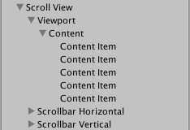

# Interaction Components

The interaction components are not visible on their own, and must be combined with one or more visual elements in order to work correctly.

## Button

## Toggle

## Toggle Group

## Slider

## Scrollbar

## DropDown

## Input Field

## Scroll Rect

A scroll Rect can be used when content that takes up a lot of space needs to be displayed in a small area.The scroll Rect provides functionality to scroll over this content.

Usually a Scroll Rect is combined with a ``` Mask ``` in order to create a scroll view, where only the scrollable content inside the Scroll Rect is visible. It can also additionally be combined with one or two ``` Scrollbars ``` that can be dragged to scroll horizontally or vertically.

**Properties:**

| Property | Function |
| -------- | -------- |
| Content | This is a reference to the Rect Transform of the UI element to be scrolled, for example a large image.
| Movement Type | Unrestricted, Elastic or Clamped. Use Elastic or Clamped to force the content to remain within the bounds of the Scroll Rect. Elastic mode bounces the content when it reaches the edge of Scroll Rect |
| Elasticity | This is the amount of bounce used in the elasticity mode. |
| Inertia | When Inertia is set the content will continue to move when the pointer is released after a drag. When Inertia is not set the content will only move when dragged. |
| Scroll Sensitivity | The sensitivity to scroll wheel and track pad scroll events. |
| ViewPort | Reference to the viewport Rect Transform that is the parent of the content Rect Transform. |
| Scrollbar Spacing | The space between the scrollbar and the viewport. | 

**Events:**

| Property | Function |
|----------|----------|
| On Value Changed | A UnityEvent that is invoked when the scroll position of the Scroll Rect Changes. The event can send the current scroll position as a Vector2 type dynamic argument. |

**Details:**

The important elements in a scroll view are ``` viewport ```, the scrolling ``` content ```, and optionally one or two ``` scrollbars ``.

- The root GameObject has the Scroll Rect component.
- The viewport has a ``` Mask ``` component. The viewport can either be the root GameObject, or a separate GameObject that's a child to the root. If auto-hiding scrollbars are used, it must be a child. The viewport Rect Transform neeeds to be referenced int the ``` Viewport ``` property of the Scroll Rect.
- All the scrolling content must be children of a single content GameObject that is a child to the viewport. The content Rect Transform needs to be referenced in the ``` Content ``` property of the Scroll Rect.
- The scrollbars - if used - are children to the root GameObject.

- 
