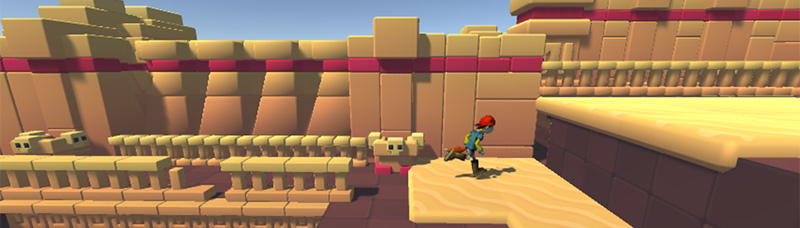
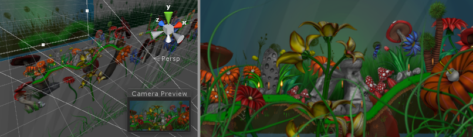

# Working In Unity

## Basics

### Full 3D

Some 3D scenes.

### Orthographic 3D

Some 3D games using an Orthographic view

### Full 2D

Some examples of typical 2D game types

### 2D gameplay with 3D graphics

A side scrolling game with 2D gameplay, but 3d graphics.

### 2D gameplay and graphics, with a perspective camera

A 2D "cardboard theatre" style game, giving a parallax movement effect

## Asset Workflow

The simplest way to move or rename your assets is to always do it from within Unity's project folder. This way, Unity will automatically move or rename the corresponding meta file.

## Scene Gizmo

The Scene Gizmo is in the upper-right corner of the Scene View. This display the Scene View Camera's current orientation, and allows you to quickly modify the viewing angle and projection mode.

!()[./imgs/Editor-SceneGizmo.png]

The Scene Gizmo has a conial arm on each side of the cube. The arms at the forefront are labelled X, Y and Z. Click on any of the conical axis arms to snap the Scene View Camera to the axis it represents(for example: top view, left view and front view)

### For position

- **Pivot** positions the Gizmo at the actual pivot point of a Mesh.
- **Center** positions the Gizmo at the center of the GameObject's rendered bounds.

### For rotation

- **Local** keeps the Gizmo's rotation relative to the GameObject's.
- **Global** clamps the Gizmo to world space orientation.